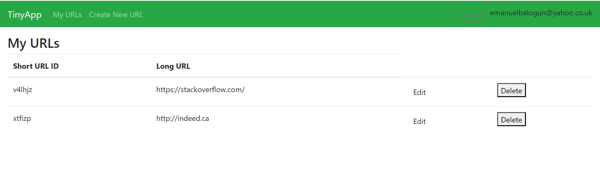
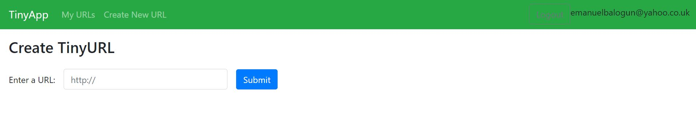

# TinyApp Project

TinyApp is a full stack web application built with Node and Express that allows users to shorten long URLs (à la bit.ly).

## Final Product
### Tiny URL Landing Page: Display Existing Tiny URL

### Create Tiny URL Preview: Gives the ability to create Tiny URL

## Dependencies
- Node.js
- Express
- EJS
- bcryptjs
- cookie-session

## Getting Started

- Install all dependencies (using the `npm install` command).
- Run the development web server using the `node express_server.js` command.
- Run the App using 'npm run start' in production
- Use `npm run dev` to start the server in development mode